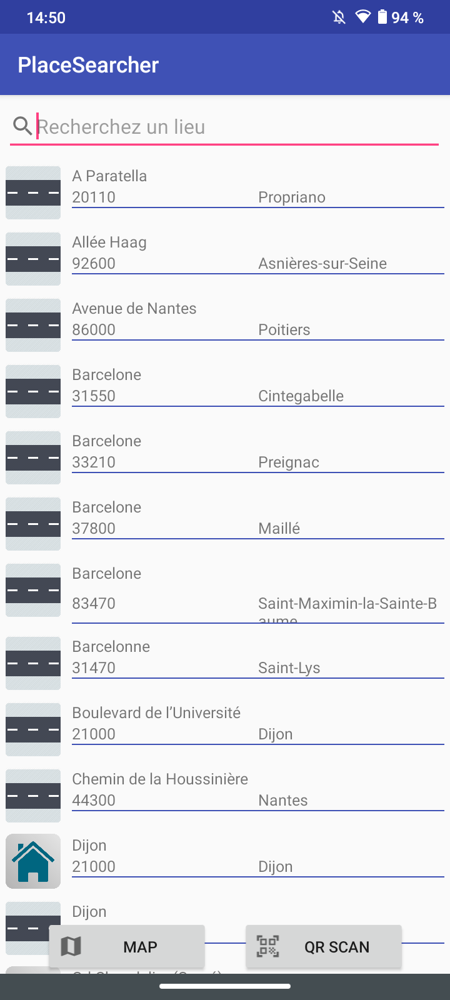

# EAD_Android
Application pour tester le framework Zxing

## Implémentation dans PlaceSearcher

Reprise de l’exemple PlaceSearcher du cours
pour générer un QR Code à partir d’une adresse
ainsi que Scanner un QR Code et effectuer une recherche.

- Si URL, recherche dans un navigateur

- Si coordonnées GPS, recherche dans le Maps de l’appli

- Sinon dans la barre de recherche de l’application

## Exemple de QR Codes

  

## Générateur de QR Code

  
  

## Scan de QR Code

  
  
  

